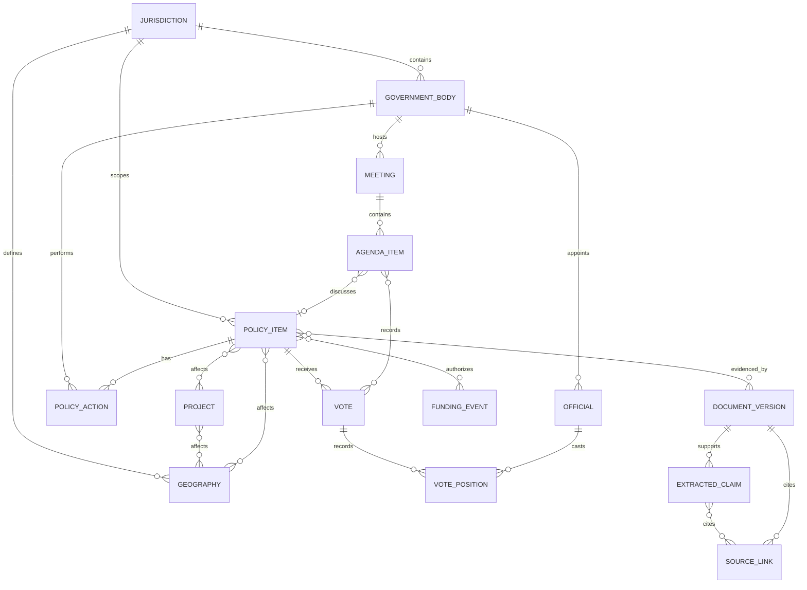

# M6 Shared Civic Core Architecture Decision Record

**Status:** Accepted for additive implementation

**Issue:** CON-27

**Reviewed against:** `main` at `f375c69` (same tree as `origin/main` on 2026-07-15)

## Decision

Congresscape will keep one application and one shared civic domain. Jurisdiction-specific source packages will fetch and normalize source-native records into the shared domain; they will not create a second LA stack or put jurisdiction branches in feed ranking.

The shared domain owns identity, relationships, lifecycle events, documents, provenance, claims, money, and geography. Federal tables remain projections during migration and remain available to preserve the current API and frontend behavior.

The migration is additive and dual-read/dual-write until parity is demonstrated. No existing federal table is dropped or repurposed as a generic table in M6.

## Current repository baseline

The live code has four relevant layers:

| Layer | Current owner | Current behavior | M6 boundary |
| --- | --- | --- | --- |
| Storage | `backend/app/models/update.py`, `backend/app/models/legislative.py` | `GovernmentUpdate` is the feed record; federal bills, actions, text versions, committees, members, votes, hearings, district lookups, and source links are separate projections. | Add generic tables beside these models; keep federal projections readable and writable. |
| Ingestion | `backend/app/ingest/base.py`, `backend/app/ingest/congress.py` | `NormalizedUpdate` is a small feed-shaped DTO; Congress normalization also produces canonical federal payloads. | Replace the long-term center of gravity with a generic normalized record plus source-specific extension payloads. |
| Backend/API | `backend/app/services/feed_service.py`, `legislative_service.py`, `update_service.py`, `backend/app/api/routes/` | Feed ranking joins `GovernmentUpdate` to federal detail tables and exposes `/api/v1/feed`, ingest, member, notification, and provenance routes. | Add a generic repository/service layer; existing routes keep their response shapes until a parity cutover. |
| Frontend | `frontend/src/features/feed/types/index.ts`, `frontend/src/navigation/RootNavigator.tsx` | `FeedItem` and detail types use federal `bill_id`, `vote_id`, `hearing_id`, and `UpdateDetail`. | Keep current types/routes; add generic fields and routes only when a product issue needs them. |

The current database bootstrap uses `Base.metadata.create_all` in `backend/app/db/init_db.py`; it is not a versioned migration system. M6 must therefore establish the field map and rollout checks before any destructive or renaming migration is attempted.

## Canonical concepts

| Concept | Canonical responsibility | Required identity and temporal fields | Federal projection | Local extension examples |
| --- | --- | --- | --- | --- |
| `Jurisdiction` | A governing scope and its parent/child relationship. | `canonical_id`, kind, parent, valid time, source authority. | US federal. | Los Angeles County, City of Los Angeles, Metro service area. |
| `GovernmentBody` | A body, agency, committee, board, department, or chamber that owns or acts on records. | `canonical_id`, jurisdiction, body type, parent body, source-native IDs, validity. | House, Senate, congressional committees. | Metro Board, City Council, Public Safety Committee. |
| `Official` | A person or office-holder with a time-bounded role. | `canonical_id`, names, identifiers, body/role, valid time, source links. | `CongressionalMember`. | Board member, council member, department official. |
| `PolicyItem` | The durable subject whose lifecycle is followed. | `canonical_id`, jurisdiction, `item_type`, title, source-native ID, lifecycle projection, valid time. | `CongressionalBill`. | Metro board report, City Council file, planning case. |
| `PolicyAction` | An observed source-native event; actions are not forced into one universal process. | `canonical_id`, item, action type/code, actor/body, event/effective time, sequence, source. | `BillAction`. | Referral, agenda placement, committee recommendation, adoption, transmission. |
| `Meeting` | A scheduled or completed public body event. | `canonical_id`, body, type/status, scheduled/held time, location, source. | `CongressionalHearing`. | Metro meeting, Council meeting, commission hearing. |
| `AgendaItem` | A meeting item that may point to a policy item, document, or action request. | `canonical_id`, meeting, ordinal, title, requested action, source. | Currently embedded in hearing/bill JSON. | Metro report item, council file agenda item. |
| `Vote` | A recorded decision attached to a meeting, agenda item, or policy item. | `canonical_id`, question, result, totals, time, source. | `CongressionalVote`. | Board vote, council vote, committee vote. |
| `DocumentVersion` | An immutable retrieved version of a source document or page. | source identity, URL, content type, published time, retrieved time, byte hash, revision key, extraction status. | `BillTextVersion` plus source-link metadata. | PDF agenda/report, CFMS page, Legistar attachment, court filing. |
| `Project` | A physical or operational effort distinct from a policy decision. | `canonical_id`, type, owner body, status, dates, source. | Future federal project context. | Rail extension, station project, capital program. |
| `FundingEvent` | A sourced authorization, budget, obligation, payment, grant, or revenue event. | `canonical_id`, event type, amount/currency, fiscal/effective time, payer/payee, linked item/project, source. | CBO and money-context records remain projection/context first. | Contract authorization, Controller payment, budget appropriation. |
| `Geography` | A versioned place, boundary, route, station, district, or service area. | `canonical_id`, type, geometry/reference, source snapshot, effective time, hash. | Congressional district mapping. | Council district, Metro route, station, project corridor. |
| `ExtractedClaim` | A source-backed assertion derived from a document or record. | stable claim ID, subject, predicate/value, extraction version, confidence, source location, review state. | Current `key_claims` and metadata become projections. | “Board authorized …”, “route 20 serves …”. |
| `SourceLink` | A source citation and provenance record attached to any canonical subject or claim. | source system/native ID, URL, source category/confidence, publication/retrieval times, document version, support type. | `LegislativeSourceLink` remains a federal projection. | Metro, City Clerk, Controller, court, GTFS, GIS. |

### Relationship shape



The database implementation should use real foreign keys for typed core relationships. `SourceLink` may use a small constrained subject-reference table for cross-concept citations, but every reference must be validated by the repository and covered by orphan/target tests; no feed code may silently attach a citation to an unknown record.

## Lifecycle semantics

`PolicyItem` stores a generic lifecycle projection, not a fake universal workflow:

```text
discovered -> published -> introduced -> under_review -> scheduled
          -> action_taken -> approved -> adopted -> enacted -> implemented
```

`withdrawn`, `rejected`, `expired`, `superseded`, `not_yet_published`, `unavailable`, and `unknown` are terminal or explicit availability states where applicable. The generic phase is optional when the source does not support it. Every item also retains `source_status`, `source_status_code`, and the ordered `PolicyAction` history so local and federal terminology is not flattened.

Examples:

- A congressional bill maps to `introduced`, `under_review`, chamber actions, votes, `enacted`, or `failed`; it does not require a meeting or project.
- A Metro report maps to a published report, agenda item, committee/board action, vote, and possibly an affected project; it does not require a bill-number lifecycle.
- A City Council file maps to referrals, agenda placement, committee/council actions, ordinance transmission, and final disposition.
- A contract authorization is a `FundingEvent` linked to a policy item or project, not evidence that an actor intended wrongdoing.
- An affected route is a versioned `Geography` linked to a policy/project relation with an explicit source and relationship type.

## Identity, uniqueness, and versioning

1. `canonical_id` is deterministic and never title-derived: `{jurisdiction-key}:{record-kind}:{source-native-key}`. Examples are `us.federal:bill:119-hr-1234`, `la.metro:board-report:2026-0308`, and `la.city:council-file:CF-26-0001`.
2. Preserve every source-native identifier, source system, and source URL. If a source has no stable identifier, use a provisional content-hash identity and mark it provisional; do not merge later by title alone.
3. Canonical IDs are unique. Source identities are unique on `(source_system, source_record_kind, source_native_id)` when the source supplies those fields.
4. Separate source time from system time: publication/event/effective/valid time are source facts; retrieval/ingestion time records when Congresscape observed them.
5. `DocumentVersion` is immutable and keyed by source identity plus revision/hash. Re-downloading identical bytes is idempotent; changed bytes create a new version. Never overwrite an older document version.
6. Current fields on `PolicyItem`, `GovernmentBody`, and `Geography` are projections of observed versions. Conflicts remain in source history and are not resolved by last-write-wins without a source rule.
7. All money values retain source-native semantics and currency/unit. Authorization, budget, obligation, payment, balance, revenue, and projection are distinct `FundingEvent` types.

## Table-by-table migration map

| Current table/model | Keep, project, or replace | Generic target | Migration rule |
| --- | --- | --- | --- |
| `government_updates` / `GovernmentUpdate` | Keep as compatibility feed projection | `PolicyItem` + `PolicyAction` + `SourceLink` | Add `generic_policy_item_id` only after generic identity exists; continue writing current columns during dual-write. |
| `entities` / `Entity` | Keep temporarily, then project | `GovernmentBody`, `Official`, `Geography`, or future `CivicEntity` extension | Do not infer type from display name; map by explicit entity-kind rules and retain unresolved IDs. |
| `congressional_bills` | Keep as federal projection | `PolicyItem(item_type=bill)` | Canonical ID maps directly; federal-specific fields stay in a projection/extension table. |
| `bill_actions` | Keep as federal projection | `PolicyAction` | Copy source-native action code, sequence, body, and times; preserve raw payload. |
| `bill_text_versions` | Keep as federal projection | `DocumentVersion` | Link existing text/source identity to immutable document versions; do not delete text rows during M6. |
| `congressional_committees` | Keep as federal projection | `GovernmentBody` | Map chamber/committee hierarchy and validity; retain Congress-specific codes. |
| `congressional_members` | Keep as federal projection | `Official` | Map Bioguide and role history; district remains a geography relationship, not a permanent member field. |
| `congressional_votes` | Keep as federal projection | `Vote` | Map bill link, question, totals, party split, and source links. |
| `member_vote_positions` | Keep as federal projection | `VotePosition` + `Official` | Resolve by stable member identifier; retain unknown/unresolved positions. |
| `congressional_hearings` | Keep as federal projection | `Meeting` + `AgendaItem` | A hearing is a federal meeting projection; related bills become typed agenda/item links. |
| `legislative_source_links` | Keep as federal projection | `SourceLink` + `DocumentVersion` | Preserve confidence/category/supports and backfill source-document identity. |
| `district_lookup_results` | Keep as federal lookup cache | `Geography` + resolution record | Store boundary/source version and match evidence; do not make ZIP a final district identity. |
| `metadata_json` on current models | Keep as raw compatibility payload | typed extension/raw-source store | Never use JSON metadata as the only location for new canonical relationships. |

## Backward compatibility

- Existing `/api/v1/feed/`, `/api/v1/ingest/updates`, `/api/v1/summary/`, `/api/v1/notifications/*`, and `/api/v1/members/district-lookup` contracts remain unchanged through M6-M8.
- `FeedService` continues to read the existing federal projection path. A generic feed repository can be introduced behind the service boundary, but the existing `FeedItemRead` and frontend `FeedItem` remain stable.
- Existing detail routes continue to accept current `FeedItem` objects and IDs. Generic records get new endpoints and navigation only in the issue that owns that product surface.
- Federal ingestion continues to write `Congressional*` projections while also producing generic records. If a generic write fails, the transaction fails before publishing a partial generic record; the legacy-only fallback is an explicitly logged operational mode, not silent data loss.
- Frontend additions use optional generic fields and new feature types. No federal route is renamed to “LA” and no second navigation tree is created.

## Migration and rollback sequence

1. **Specify:** land this ADR, the field map (`CON-53`), and model/API acceptance fixtures (`CON-52`).
2. **Add schema:** add generic tables and foreign keys (`CON-55`) without altering current tables; introduce versioned migration execution before any non-additive change.
3. **Add repositories/schemas:** implement typed generic repositories and API schemas (`CON-56`); add source/claim indexing (`CON-57`).
4. **Add source packages:** introduce a jurisdiction registry and adapter boundary (`CON-58`), then route Congress through it while preserving federal projections (`CON-30`).
5. **Dual-write federal:** map existing Congress payloads into generic records and compare generic/federal identifiers and source trails. Federal regression tests remain required.
6. **Add LA fixtures and adapters:** Metro first (`CON-59`–`CON-61`), then documents/diffs, City Clerk, money, and operations in the dependency order tracked by M7-M10.
7. **Dual-read and compare:** run both repositories for deterministic fixtures, record mismatches, and keep the current API as the compatibility read until parity is accepted.
8. **Cut over per surface:** switch one backend surface at a time behind a narrow feature flag or repository selection; retain projection writes until rollback is no longer needed.
9. **Retire only after evidence:** remove federal-only duplication only in a later migration with explicit backfill counts, foreign-key checks, regression output, and a rollback snapshot.

Rollback is a forward-safe stop: disable generic reads, stop or quarantine generic writes, keep the existing federal projection writer and API reads active, and reconcile from source checkpoints. Every dual-write batch must have an idempotent source identity and a batch/retrieval timestamp. No rollback step deletes source documents, prior versions, or existing federal rows.

## Future issue target map

| Issue | Target model or extension point |
| --- | --- |
| CON-52 | Shared model specification and fixture contract for the generic core; no runtime table change by itself. |
| CON-53 | Field-level mapping and versioned migration plan from current federal tables/JSON payloads to generic tables. |
| CON-54 | Schema rollout verification, migration checkpoints, parity counts, rollback probes, and federal-row preservation checks. |
| CON-28, CON-55, CON-56 | Generic `Jurisdiction`, `GovernmentBody`, `Official`, `PolicyItem`, `PolicyAction`, `Meeting`, `AgendaItem`, `Vote`, `VotePosition`, `Project`, `FundingEvent`, `Geography`; repositories and API schemas. |
| CON-29, CON-57 | `ExtractedClaim`, `SourceLink`, `DocumentVersion` location indexes, entity resolution evidence. |
| CON-30, CON-58 | `JurisdictionSourcePackage`, adapter registry, generic normalization boundary. |
| CON-31, CON-59, CON-60 | Metro source package, source inventory, raw/fixture capture, `Meeting`, `AgendaItem`, `PolicyItem`, `DocumentVersion`. |
| CON-32, CON-61 | Metro `PolicyItem` extensions and ordered `PolicyAction` lifecycle assembly. |
| CON-33, CON-62 | Immutable `DocumentVersion`, source-document identity, page/table extraction artifacts. |
| CON-34, CON-63 | Version-to-version document diff, materiality record, source-linked alert candidate. |
| CON-35, CON-64 | City Clerk `PolicyItem`, agenda/referral/action/vote adapters, native lifecycle extensions. |
| CON-36, CON-65 | `FundingEvent`, vendor identity extension, dataset snapshot/source metadata, validation fixtures. |
| CON-37, CON-66 | Typed cross-source relationship edges, entity-resolution evidence, audit history. |
| CON-38, CON-67 | Versioned `Geography`, `Project`, route/station operational extensions, dataset snapshots. |
| CON-39, CON-68 | Evidence comparison records linking `PolicyItem`/`Project` to operations and labeled claim types. |
| CON-40, CON-69 | Generic feed/detail projections and jurisdiction-aware frontend feature types; current routes remain compatible. |
| CON-41, CON-70 | Address resolution records, versioned `Geography`, boundary snapshots, nearby-entity edges, privacy controls. |
| CON-42, CON-71 | Follow subscriptions over canonical IDs, query/delivery jobs, source-backed alert candidates. |
| CON-43, CON-72 | Ingestion run/checkpoint/health records, retry and freshness diagnostics. |
| CON-44, CON-73, CON-75 | Claim review states, output validation, accessibility/privacy/security checks, neutral copy rules. |
| CON-45, CON-74, CON-76 | Deployment/release records, smoke environments, backup snapshots and restore verification. |
| CON-46 | Product research artifact; no schema dependency until a validated paid workflow exists. |
| CON-47, CON-48 | Organization/watchlist/entitlement extensions over canonical IDs; deliberately post-MVP. |
| CON-49 | County jurisdiction package using `GovernmentBody`, `Meeting`, `AgendaItem`, `PolicyItem`, `DocumentVersion`, and `Geography`. |
| CON-50 | City Planning/Police Commission jurisdiction extensions using `PolicyItem`, `Meeting`, `DocumentVersion`, and explicit source joins. |
| CON-51 | Jurisdiction onboarding templates/registry validation; no new domain table required by itself. |
| CON-77, CON-78 | Court/litigation source package using `PolicyItem(item_type=litigation)`, `DocumentVersion`, `ExtractedClaim`, `GovernmentBody`, `Project`, and `Geography`. |

## Verification plan

### M6 design and schema checks

- Field-map review proves every current federal table has a target and no destructive change is required.
- Model tests cover canonical-ID uniqueness, source-native-ID preservation, temporal fields, immutable document hashes, typed funding semantics, and relationship orphan behavior.
- Migration tests run additive schema creation against SQLite and PostgreSQL, then exercise rollback/disable behavior without deleting federal rows.

### Federal regression

Keep the current targeted suites passing: `test_feed_m2.py`, `test_legislative_m1.py`, `test_provenance_diagnostics.py`, `test_notification_alerts.py`, and `test_civic_feed_smoke.py`. Also retain `npx tsc --noEmit` and the existing browser smoke for current routes.

### LA fixture coverage

The first fixture matrix should represent: a Metro board report with agenda item and vote; a City Council file with referral and document revision; a contract authorization linked to a project; a route geography with a versioned source snapshot; and an unavailable or parser-failed source. Tests must be deterministic and network-free.

## Non-goals

- No separate LA backend, frontend, database, or feed-ranking stack.
- No generic chatbot or request-path LLM dependency.
- No weakening of primary-source requirements, provenance links, unavailable states, or neutral money-context language.
- No broad frontend rewrite or route rename in M6.
- No deletion of federal projections until parity, rollout, and rollback evidence exists.
